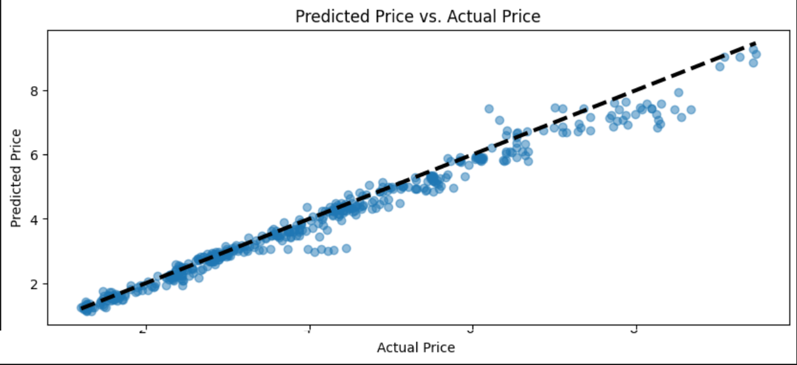
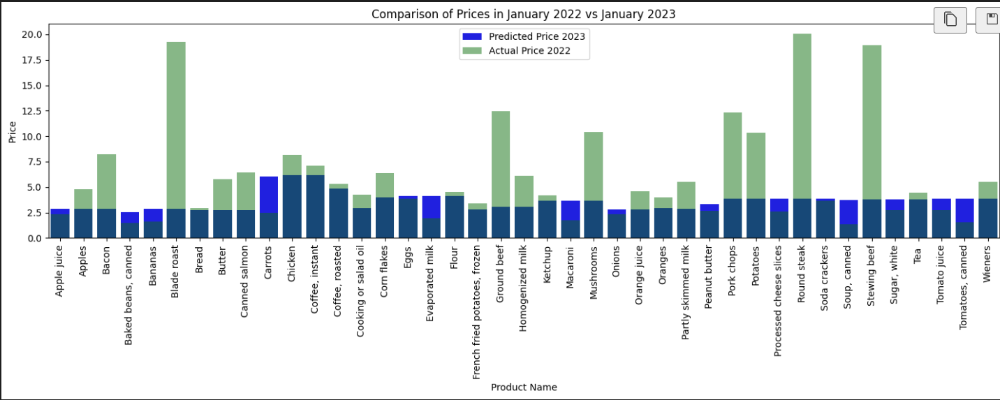

## #Food Track Canada Project  🍁📈
Food cost estimating tool for food trucks and small food businesses

By:
## Hajar Kaddouri
## Niki Yaw
## Tetiana Fesenko
## Madison Wiebe

## #HK-Version1:

## #Project Overview 📋
The Food Track Canada project is an in-depth analysis and prediction task focused on retail food prices. We've harnessed data from various sources, performed exploratory data analysis, and built a predictive model to forecast food prices.

## #Data Extraction 🛠️
We began by extracting red meat data from the Agri Canada website. This initial step provided us with a robust dataset that set the stage for our subsequent analyses.

## #Data Discovery and Preprocessing 🔍📝
After obtaining the data, we transformed it into a format suitable for analysis in Jupyter Notebook. New CSV files were created to ensure readability and compatibility with our tools.

## #Exploratory Data Analysis (EDA) 🕵️‍♂️📈
The EDA phase allowed us to dive deep into the characteristics of the red meat data, resulting in insightful visualizations that revealed trends and patterns.

## #Data Acquisition and Further EDA 🥗➕
We incorporated additional data on retail prices of various food products from 1995 to 2022. This data underwent a similar EDA process to understand its intricacies.

## #Data Preprocessing and Model Training 🖥️👩‍🔬
The data was then preprocessed, with categorical variables being hard-coded. A decision tree model was trained using data from before 2020 and tested on data from after 2020.

## #Model Performance Summary 📊💡
Our model's effectiveness was assessed using several metrics:

RMSE: 0.3292
MAE: 0.2171
R-squared: 0.9712
These metrics indicate a high level of accuracy and reliability in our model's predictions.

## #Predictions for 2023 🚀🔮
Predictions for the year 2023 were made and stored in a DataFrame. We visualized these predictions to compare them with historical prices, as shown in this images.

 
 

## #Interactive Dashboard 🖥️🤹
An interactive dashboard was created in Tableau, featuring an item list that allows users to view the predicted and actual prices of selected items, along with their score positions.

Contribution to GitHub 🌐👨‍💻
All work has been pushed to our GitHub repository to make it accessible to project managers and team members.

-------------------------------------------------------------------------------------------------------------------

Version2
Version3
Version4