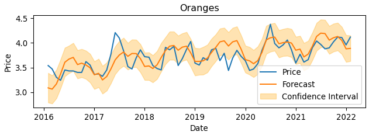

<!-- PROJECT LOGO -->
 

  

<h1 align="center">Food Cost Visualizer</h3>

  

    Estimating food ingredient costs for food trucks and other small businesses.
  

<!-- TABLE OF CONTENTS -->

  
Table of Contents

  <ol>
    <li>
      <a href="#about-the-project">About The Project</a>
      <ul>
        <li><a href="#Workflow">Workflow</a></li>
        <li><a href="#data-considerations">Data Considerations</a></li>
        <li><a href="#tech-stack">Tech Stack</a></li>
      </ul>
    </li>
    <li>
      <a href="#process">Process</a>
      <ul>
        <li><a href="#data-acquisition">Data Acquisition</a></li>
        <li><a href="#data-cleaning-and-eda">Data Cleaning and EDA</a></li>
        <li><a href="#feature-engineering">Feature Engineering</li>
        <li><a href="#forecasting-and-visualizations">Forecasting and Visualizations< /li>
      </ul>
    </li>
    <li><a href="#results">Results</a></li>
    <li><a href="#challenges">Challenges</a></li>
    <li><a href="#future-goals">Future Goals</a></li>
    <li>
      <a href="#contributors">Project Contributors</a>
      <ul>
        <li><a href="#project-management">Project Management</a></li>
        <li><a href="#data-team-members">Data Team Members</a></li>
      </ul>
    </li>
  </ol>

<!-- ABOUT THE PROJECT -->
## About the Project

With food costs ever on the rise, the objective of this project is to create a tool to help food truck owners estimate their ingredient costs. Visualizing ingredient costs as well as trends in ingredient prices are key features of this tool.

<!-- EXAMPLE DASHBOARD -->
 

    

This project currently uses historic Monthly Retail Average (MRA) price data from Statistics Canada to estimate ingredient prices and develop tools for predictive modeling. 

<!-- WORKFLOW -->
### Workflow

1. Identifying the most appropriate data source. Statistics Canada as well as Agriculture Canada both offer several types of food price data (farm supplier prices, wholesale prices, retail prices).
2. Identifying the best method of data acquisition. We experimented with manual download parameters, API calls, and a Python library for retriving data from Statistics Canada.
3. Performing Exploratory Data Analysis (EDA) on raw datasets. This included visualizing overall trends, cleaning and standardizing variables, and feature engineering to create new columns for category and unit price.
4. Testing the viability of using predictive modeling to forecast ingredient prices. Modeling approaches included:
   - Decision tree
   - Facebook Prophet
   - Linear regression
   - Random forest
5. Creating a dashboard to visualize price metrics.

<!-- DATA CONSIDERATIONS -->
### Data considerations: 
- We used [Statistics Canada Table #18-10-0002-01](https://www150.statcan.gc.ca/t1/tbl1/en/tv.action?pid=1810000201) as the basis for our predictive modeling and building example dashboards. This dataset is the most extensive (values dating from January 1995 - February 2022) which makes it ideal for training prediction models. However, it does not offer price data at the provincial level, and it is no longer updated. It has been replaced by [Table #181-002-45-01](https://www150.statcan.gc.ca/t1/tbl1/en/tv.action?pid=1810024502), which includes values from January 2017 - October 2023 (as of December 2023) and includes both national and provincial price data. 
- The ingredients included in the Statistics Canada database are not comprehensive; there are likely ingredients that a vendor would have on their menu that do not exist in our data.

To achieve a more realistic representation of changing ingredient prices and provide a more reliable estimator tool, more data must be collected, standardized, and integrated.

<!-- TECH STACK -->
### Tech stack:
- Python
- Pandas
- MatPlotLib
- Tableau

(<a href="#readme-top">back to top</a>)

<!-- PROCESS -->
## Process
<!-- DATA ACQUISITION -->
### Data Acquisition
- Dataset was downloaded using the [stats_can](https://stats-can.readthedocs.io/en/latest/) Python module

<!-- DATA CLEANING AND EDA -->
### Data cleaning and EDA
- Import dataset as a Pandas DataFrame
- Remove rows containing irrelevant products 
- Filter for relevant columns
  - Date
  - Location
  - Price
  - Product
  - VectorID

<!-- FEATURE ENGINEERING -->
### Feature engineering
- Split Product column into Product and Unit columns
- Split Unit column into Unit and Unit Quantity
- Standardize unit values to be strictly numeric (e.g. "each" -> "1 {unit}")
- Create a Category column with values assigned based on keywords

<!-- FORECASTING AND VISUALIZATIONS -->
### Forecasting and Visualizations
- Use various approaches to predict ingredient parameters based on historic price data
  - Dollar value
  - Percent change
  - Z-score
- Create Tableau dashboards to display parameters of interest
  - Menu items based on ingredient selection
  - Menu item ingredients prices over time
  - A "Cost-Effectiveness" metric to indicate changes in ingredient prices

(<a href="#readme-top">back to top</a>)

<!-- RESULTS -->
## Results

The results of this project are intended to lay the groundwork for more detailed analysis with more comprehensive data. 

Key achievements include creating the framework for an efficient data pipeline and exploring several means of predictive modeling, with models ranging between 84% and 97% accuracy. 

(<a href="#readme-top">back to top</a>)

<!-- EXAMPLE PREDICTION -->
 

    

<!-- CHALLENGES -->
## Challenges 

- Data availibility proved to be the primary challenge. Most datasets had limitations in high-priority variables (date, location, specific ingredients) or timespan (range of historic data, frequency of data updates). 
- Developing an interface for user input in Tableau was not well-supported. Another user interface tool will need to be explored.

(<a href="#readme-top">back to top</a>)

<!-- FUTURE GOALS -->
## Future Goals

- Combine data from other province-specific resources to improve ingredient list.
- Create product-specific calculated fields to capture price fluctuations.
- Explore integration with SQL to improve performance and reduce memory/processing load (see [SQL database ERD draft](data_analysis/SQL_DB_ERD_future_use.pptx)).
- Explore tools such as [Streamlit](https://streamlit.io/) to use as a user interface. User input parameters should include:
  - Creating multiple menu items
  - Selecting the ingredients that make up each menu item
  - Inputting the quantity of each ingredient required by each menu item

(<a href="#readme-top">back to top</a>)

<!-- PROJECT CONTRIBUTORS -->
## Project Contributors

Thank you for your interest in this project! 
The people who have contributed to the design and development of our food cost visualization tool can be found here:

<!-- PROJECT MANAGEMENT -->
### Project Management
- [Mackenzie Peck](https://github.com/MackieFTAC)

<!-- DATA TEAM MEMBERS -->
### Data Team Members
- [Tetiana Fesenko](https://github.com/tetianafesenko)
- [Hajar Kaddouri](https://github.com/hajar-kaddouri)
- [Madison Wiebe](https://github.com/madiwiebe)
- [Niki Yaw](https://github.com/nikiyaw)

  
(<a href="#readme-top">back to top</a>)

